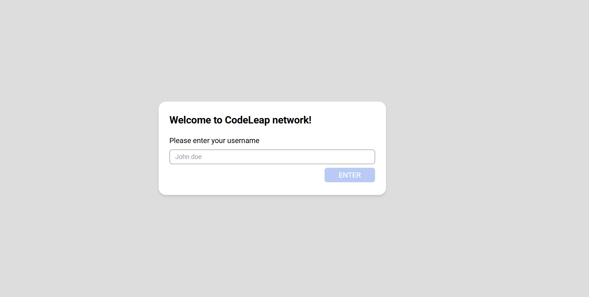
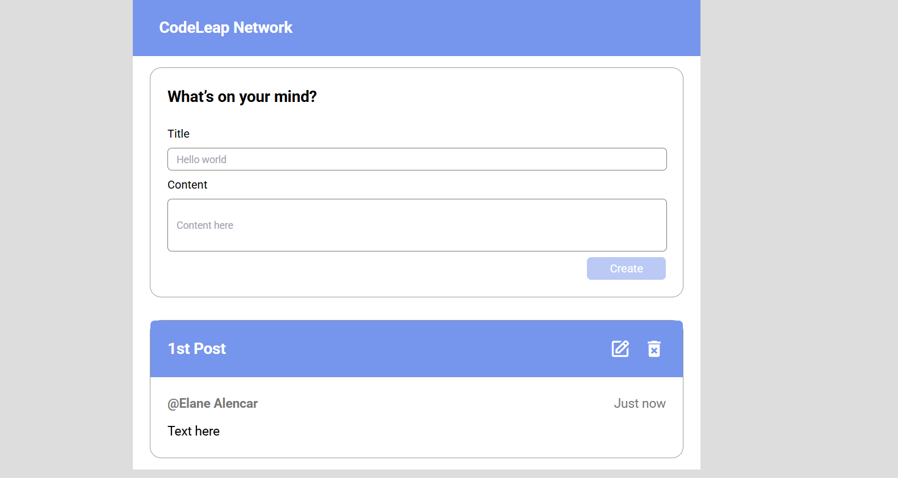

ENGLISH 
# CodeLeap Network

**CodeLeap Network** is a simple social network application where users can create posts, view posts from other users, and edit or delete their own posts. The application consists of two main screens:

1. **Login Screen**: Allows the user to enter their username.
2. **Main Screen**: Where users can create, edit, and delete posts.

This project was built using **React**, **Redux** for state management, and **Axios** for HTTP requests. The styling is based on **Tailwind CSS** for a responsive and modern design.

## Features

- **Login Screen:**:
  - The user can enter their username, which will be saved in localStorage and Redux.
  - After a successful login, the user is redirected to the main screen.

- **Main Screen:**:
  - The user can create, edit, and delete posts.
  - Display posts created by other users.
  - View the time since each post was created.

## Technologies Used

- **React**: Biblioteca JavaScript para construir a interface de usuário.
- **Redux**: For global state management (username).
- **Tailwind CSS**: CSS framework for styling.
- **Axios**: For making HTTP requests to the post API.
- **React Router**: For navigation between pages.
- **TypeScript**: For static typing.

## Prerequisites

- Node.js
- npm or yarn

## Installation

1. Clone the repository:
   git clone https://github.com/elanealencar/codeleap-network.git

2. Navigate to the project directory:
    cd codeleap-network

3. Install dependencies:
    npm install
    ou
    yarn install

## Project Structure

src/
├── assets/              # Images and icons
├── components/          # Reusable components (e.g., CreatePost, DeleteModal, EditModal)
├── store/               # Redux store and slices
├── pages/               # Main pages (Login, Main)
├── App.tsx              # Main component
├── index.tsx            # React entry point
└── styles/              # Styling files (Tailwind)

## Project Flow
1. Login Screen:
The user enters a username and, upon submitting the form, the username is saved in localStorage and in the global state using Redux. After logging in, the user is redirected to the main screen.

2. Main Screen: 
The main screen displays posts made by users. The user can:
  - Create a new post (title and content).
  - Edit existing posts.
  - Delete posts.
  - Each post shows the author's name, content, and the time since it was created.

3. Modals
  - Edit Modal: Allows editing the title and content of a post.
  - Delete Modal: Allows deleting the selected post.

# Screenshots

#
Project developed by Elane Alencar [LinkedIn](https://www.linkedin.com/in/elanealencar/), as a technical challenge for a job selection process.

---------------------
PORTUGUESE 
# CodeLeap Network

O **CodeLeap Network** é um aplicativo simples de rede social onde os usuários podem criar posts, visualizar posts de outros usuários, editar e excluir suas postagens. O aplicativo é composto por duas telas principais:

1. **Tela de Login**: Permite que o usuário insira seu nome de usuário.
2. **Tela Principal**: Onde os usuários podem criar, editar e excluir posts.

Este projeto foi construído usando **React**, **Redux** para o gerenciamento de estado e **Axios** para chamadas HTTP. O estilo é baseado no **Tailwind CSS** para um design responsivo e moderno.

## Funcionalidades

- **Tela de Login**:
  - O usuário pode inserir seu nome de usuário, que será salvo no `localStorage` e no Redux.
  - Após o login bem-sucedido, o usuário é redirecionado para a tela principal.

- **Tela Principal**:
  - O usuário pode criar, editar e excluir posts.
  - Exibição de posts criados por outros usuários.
  - Visualização do tempo desde que cada post foi criado.

## Tecnologias Utilizadas

- **React**: Biblioteca JavaScript para construir a interface de usuário.
- **Redux**: Para gerenciamento de estado global (nome de usuário).
- **Tailwind CSS**: Framework de CSS para estilização.
- **Axios**: Para fazer chamadas HTTP para a API de posts.
- **React Router**: Para navegação entre as páginas.
- **TypeScript**: Para tipagem estática.

## Pré-requisitos

- Node.js
- npm ou yarn

## Instalação

1. Clone o repositório:
   git clone https://github.com/elanealencar/codeleap-network.git

2. Navegue até o diretório do projeto:
    cd codeleap-network

3. Instale as dependências:
    npm install
    ou
    yarn install

## Estrutura do Projeto

src/
├── assets/              # Imagens e ícones
├── components/          # Componentes reutilizáveis (ex: CreatePost, DeleteModal,EditModal)
├── store/               # Redux store e slices
├── pages/               # Páginas principais (Login, Main)
├── App.tsx              # Componente principal
├── index.tsx            # Ponto de entrada do React
└── styles/              # Arquivos de estilo (Tailwind)

## Fluxo do Projeto
1. Tela de Login
O usuário insere um nome de usuário e, ao submeter o formulário, o nome de usuário é salvo no localStorage e no estado global utilizando o Redux. Após o login, o usuário é redirecionado para a tela principal.

2. Tela Principal
A tela principal exibe os posts feitos pelos usuários. O usuário pode:

Criar um novo post (título e conteúdo).

Editar posts existentes.

Excluir posts.

Cada post exibe o nome do autor, o conteúdo e o tempo desde que foi criado.

3. Modais
Modal de Edição: Permite editar o título e o conteúdo do post.
Modal de Exclusão: Permite excluir o post selecionado.

# Screenshots

*Projeto desenvolvido por Elane Alencar [LinkedIn](https://www.linkedin.com/in/elanealencar/), como desafio técnico para um processo seletivo.